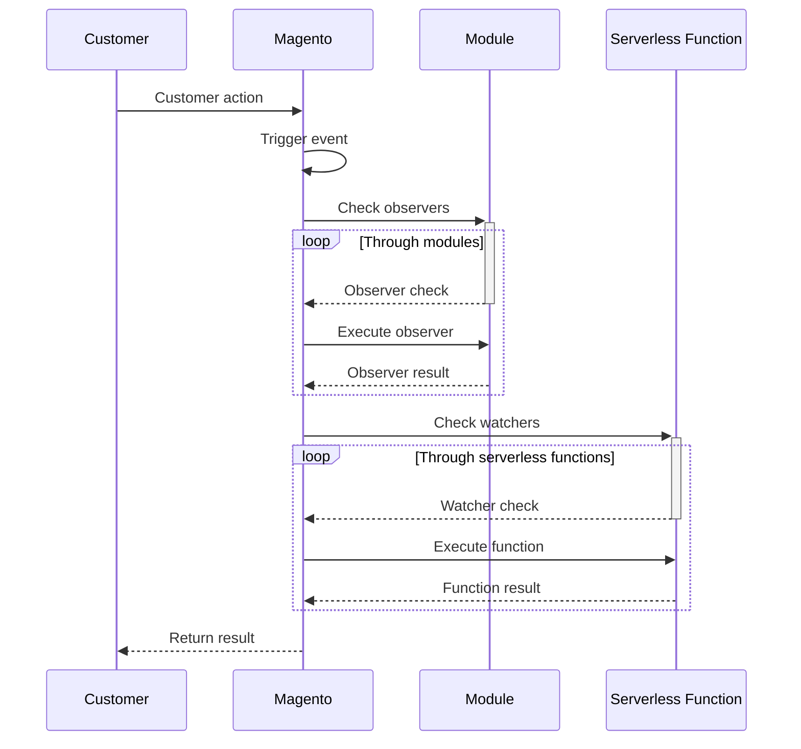

<p align="center">


</p>
<h2 align="center">
  Serverless Framework for Magento 2
</h2>

<h4 align="center"><b>Implement custom functionality, data validation and much more using serverless functions out of the Magento codebase.</b></h4>

<p align="center">With this Magento module, developers can implement data validation, add custom functionality, and much more using serverless functions that aren't part of the codebase.</p>

<p align="center">&nbsp;&nbsp;</p>

<br/>

# What's serverless?

Serverless computing is a method of providing backend services on an as-used basis. A serverless provider allows users to write and deploy code without the hassle of worrying about the underlying infrastructure. A company that gets backend services from a serverless vendor is charged based on their computation and do not have to reserve and pay for a fixed amount of bandwidth or number of servers, as the service is auto-scaling. Note that despite the name serverless, physical servers are still used but developers do not need to be aware of them.

In the early days of the web, anyone who wanted to build a web application had to own the physical hardware required to run a server, which is a cumbersome and expensive undertaking.

Then came cloud computing, where fixed numbers of servers or amounts of server space could be rented remotely. Developers and companies who rent these fixed units of server space generally over-purchase to ensure that a spike in traffic or activity will not exceed their monthly limits and break their applications. This means that much of the server space that gets paid for can go to waste. Cloud vendors have introduced auto-scaling models to address the issue, but even with auto-scaling an unwanted spike in activity, such as a DDoS Attack, could end up being very expensive.

<p align="center"></p>

Serverless computing allows developers to purchase backend services on a flexible ‘pay-as-you-go’ basis, meaning that developers only have to pay for the services they use. This is like switching from a cell phone data plan with a monthly fixed limit, to one that only charges for each byte of data that actually gets used.

The term ‘serverless’ is somewhat misleading, as there are still servers providing these backend services, but all of the server space and infrastructure concerns are handled by the vendor. Serverless means that the developers can do their work without having to worry about servers at all.

<b><i>Source: https://www.cloudflare.com/learning/serverless/what-is-serverless/</i></b>

<br/>
<br/>

# Why using serverless in Magento?
Magento is well-known and preferable in the e-commerce space when there's a need for customizations as it's open-source.

With Magento, we can develop and add new functionality, modify an existing one, add some business logic, data validation, etc.

But that's its gift and curse because Magento has frequent updates to its core, security patches, etc, and usually, a webshop built with Magento will have dozens (if not hundreds) of modules and customizations, making this process painful and a lot of times, and difficult to deal with.

With serverless functions we can achieve almost the same things, not having to install modules or modify the Magento code base. Essentially, we will customizations running out of the Magento codebase, hosted somewhere else, and this will facilitate the maintainability and upgradeability as we will manage these customizations out of the codebase and we can even use different programming languages for these functions if we want.

<br/>

## Differences between standard extensibility VS serverless
### Standard extensibility approach
Standard customizations are going to be modules/plugins that we develop or install directly on the Magento e-commerce platform. That's the usual and standard approach to extending the Magento functionality.

These plugins will add new functionality by rewriting/intercepting the core code, introduce new business logics, and data validation. They are part of the code base, on a layer up to the Magento core.

<br/>

<p align="center"><br/><i>Magento standard extensibility diagram</i></p>

<br/>

### Serverless approach
Using the serverless approach we can choose our preferable hosting providers such as Google Cloud, AWS, or Azure, develop our custom functionality as serverless functions using any programming language that they support (it doesn't need to be PHP as Magento), deploy and manage this code directly on the hosting provider, and that's it, these serverless functions will be triggered from Magento once an event happens. For example, let's say we want to use a cart validation that doesn't allow customers to order more than 3 units of a single SKU per week. We develop and deploy a serverless function that's triggered on the add-to-cart event, the serverless function will get the request data from Magento, validate, and then return if it's fine or not.

In that way, we can not only use any programming language to write this code, but we can easily maintain and release new versions of it without having to interfere with the website at all. And this will make it a lot easier to manage future Magento upgrades as the core will remain almost untouchable as there are almost no custom extensions rewriting it anymore.

<p align="center"><br/><i>Magento serverless extensibility diagram</i></p>

<br/>

### So why use serverless?
- Freedom of using any programming language to customize the platform (doesn't necessarily require a Magento developer).
- Maintainability. You can easily maintain, deploy, and manage customizations without having to deploy the website. You isolate pieces of functionality.
- Extensions are not part of the codebase. Leave the codebase for the core, and for the storefront theme. Handle the rest out of it.
- Cheaper. With headless you pay for only what you use. Forget about expensive cloud instances and replications.
- End of Magento upgrade nightmares. Leave the codebase for the Magento core. Make your life a lot easier when dealing with platform upgrades. Upgrade quicker.

<br/>

### An alternative to Adobe.io
Adobe recently release something similar to this service, but only for Adobe Commerce customers through Adobe.io. But this requires customers to use their service to deploy and manage serverless functions and again, it's only available for Adobe Commerce customers. This module is a way to not only offer this type of implementation to also Open-Source customers, but also to give the option of choosing the hosting provider that you prefer to run your serverless functions.

<br/>
<br/>

# The framework
## How it works
Magento developers are well familiar with [observers](https://developer.adobe.com/commerce/php/development/components/events-and-observers/event-list/). They are events triggered within the platform when a specific action happens. For example, a product was added to the cart. A **checkout_cart_product_add_before** event is triggered and allow modules/plugins to intercept it, get its data, and do something. This a well-common practice by extension vendors and developers. We can do a lot of things we these events. But, these events can only be observed and intercepted by modules installed on the Magento codebase. Well, until now.

This Magento module will make Magento able to not only trigger these events making it possible to install modules to intercept it, but we can now also register serverless functions deployed in one of the supported hosting providers and make them able to also receive the data from the dispatched event and do something. In that way, we can have code out of the codebase able to modify the business logic, add custom validations, etc, without having to develop another Magento extension to be part of its codebase.

Magento uses the ***Magento\Framework\Event\Manager\Proxy*** class to analyze events and see if they can be caught by an installed Magento extension. So, our framework replaces this class by using our ***ImDigital\Serverless\Event\Manager\Proxy*** which makes it possible to not only use observers from installed modules but also observers from serverless functions. So, in case an event is triggered, Magento will first look through the installed modules, see if there are any observers to be executed, executed them, and then do the same for the registered serverless functions. So, it will loop through the serverless functions registered to catch that event and will run them one by one.

<br/>



<p align="center"><i>UML sequence diagram explaining the framework workflow</i></p>

<br/>

The complete list with available observers in Magento is available at [https://developer.adobe.com/commerce/php/development/components/events-and-observers/event-list/](https://developer.adobe.com/commerce/php/development/components/events-and-observers/event-list/). Any of these actions can be supported by our serverless framework. The data will be transformed into a JSON object and then passed to the serverless function.

This module will add a new database table called ***serverless_functions***. On this table, we will register the serverless functions that are going to be connected with Magento and will watch for events. In this table we set the name of the function on the hosting provider, a short description explaining what the function is gonna do, what's the cloud provider, the Magento observed event, a flag to enable/disable the serverless function, and the cloud configuration which is the field where we set the cloud access key, regions, etc. The cloud configuration key is going to have an encrypted value, encrypted with the Magento encryption key.

<br/>

<p align="center"><br/><i>Magento serverless extensibility diagram</i></p>

## How the serverless functions are called
Each hosting provider is going to have its own Magento serverless package, meaning that they are going to extend this serverless module, adding the code that's going to be responsible to make the call to the serverless function on the hosting provider to get back the data.

Every cloud provider package must have a Provider.php class which is the one where this logic is implemented. This call will implement the ***ImDigital\Serverless\Api\Data\CloudProviderInterface*** interface which has the methods they all must implement to make that happen. In that way, all cloud providers are going to follow the same standard.

<br/>

```php
<?php

declare(strict_types=1);

namespace ImDigital\Serverless\Api\Data;

interface CloudProviderInterface
{
    /**
     * @param ServerlessFunctionInterface $serverlessFunction
     * @param array $data
     * @throws \Exception
     * @return void
     */
    public function execute(ServerlessFunctionInterface $serverlessFunction, array &$data): void;

    /**
     * @param ServerlessFunctionInterface $serverlessFunction
     */
    public function getCloudConfig(ServerlessFunctionInterface $serverlessFunction);
}

```

<p align="center"><i>The CloudProviderInterface</i></p>

<br/>

These provider classes almost must extend the ***ImDigital\Serverless\Model\Cloud\Provider*** abstract class. It has two methods, ***prepareRequestData*** and ***prepareResponseData*** which are used to prepare the data for the request and also to handle the response respectively. The class is available at https://raw.githubusercontent.com/Imagination-Media/magento-serverless/master/Model/Cloud/Provider.php.

An example of a cloud provider implementation can be found at https://raw.githubusercontent.com/Imagination-Media/magento-serverless-gcp/master/Model/Cloud/Provider.php. That's the Google Cloud provider implementation.

The cloud providers are configured and added to the list of supported hosting providers by injecting their cloud provider class into the class. We do that by using the etc/di.xml file. For example, this is the configuration for the [Google Cloud package](https://raw.githubusercontent.com/Imagination-Media/magento-serverless-gcp/master/etc/di.xml):

```xml
<?xml version="1.0"?>
<config xmlns:xsi="http://www.w3.org/2001/XMLSchema-instance" xsi:noNamespaceSchemaLocation="urn:magento:framework:ObjectManager/etc/config.xsd">
    <!-- Injecting cloud provider -->
    <type name="ImDigital\Serverless\Model\ServerlessFunctionConfigRepository">
        <arguments>
            <argument name="cloudProviders" xsi:type="array">
                <item name="gcp" xsi:type="object">ImDigital\ServerlessGcp\Model\Cloud\Provider</item>
            </argument>
        </arguments>
    </type>
</config>
```

<br/>

## The JSON config file
The serverless functions that are connected with Magento are set up in Magento by adding the needed information to the **serverless_functions** database table. But, when the Magento framework is running is checking the observers it's much faster to read these setup functions config from somewhere else rather than the database. So, there's a CLI command on this framework, that generates the config from the database into a JSON file, containing all the information the framework needs in order to set up the connection with the hosting provider and execute the serverless function.

The command is:

```ssh
php bin/magento serverless:deploy:config
```

As part of our roadmap, we will add an interface to the Magento admin where we can manage these serverless functions, enable/disable them, etc. For now, we can only add these functions directly to the database.

<br/>
<br/>

# Installation
## Installing the module and enabling it

To install this module we must run the composer require command requesting its installation:

```ssh
composer require imdigital/magento-serverless
```

<br/>

Then, enable it by modifying the app/etc/config.php or running the CLI command:

```ssh
php bin/magento module:enable ImDigital_Serverless
```

<br/>

And finally, we need to modify the ***app/etc/di.xml*** file changing Magento to use the ***ImDigital\Serverless\Event\Manager\Proxy*** class to manage the events engine instead of the ***Magento\Framework\Event\Manager\Proxy*** core class.

You can do that by creating a new patch with the content:

```patch
--- app/etc/di.xml	2023-02-28 20:18:29.577784341 +0000
+++ app/etc/di.xml	2023-02-28 20:19:12.078146055 +0000
@@ -67,7 +67,7 @@
     <preference for="Magento\Framework\Event\ConfigInterface" type="Magento\Framework\Event\Config" />
     <preference for="Magento\Framework\Event\InvokerInterface" type="Magento\Framework\Event\Invoker\InvokerDefault" />
     <preference for="Magento\Framework\Interception\PluginListInterface" type="Magento\Framework\Interception\PluginList\PluginList" />
-    <preference for="Magento\Framework\Event\ManagerInterface" type="Magento\Framework\Event\Manager\Proxy" />
+    <preference for="Magento\Framework\Event\ManagerInterface" type="ImDigital\Serverless\Event\Manager\Proxy" />
     <preference for="Magento\Framework\View\LayoutInterface" type="Magento\Framework\View\Layout" />
     <preference for="Magento\Framework\View\Layout\ProcessorInterface" type="Magento\Framework\View\Model\Layout\Merge" />
     <preference for="Magento\Framework\View\Layout\LayoutCacheKeyInterface" type="Magento\Framework\View\Model\Layout\CacheKey" />

```

And then, make it to be applied as part of your post-composer install process. You can do that by editing the composer.json file and adding this:

```
"scripts": {
        "post-install-cmd": [
            "git apply m2-hotfixes/di-patch.patch"
        ]
},
```

This patch file is also available on this repository: https://raw.githubusercontent.com/Imagination-Media/magento-serverless/master/di-patch.patch

</br>
</br>

## Environment variables
There are a couple of environment variables that we can use to configure a few things in this framework:

- **MAGENTO_SERVERLESS_FILE_PATH** - As described, this framework generates a JSON file with the serverless functions config. This environment variable allows us to define where this file will be created. By default (and if not set), this value will be ***var/serverless/functions.json***.
- **MAGENTO_SERVERLESS_TIMEOUT** - This environment variable is used to set, in milliseconds, the timeout for the serverless functions. By default, it uses 4000 (4 seconds).

<br/>
<br/>

# Supported cloud providers

This is the list of the currently supported cloud providers by this framework.

Cloud Provider     | Repository
-------- | -------
Google Cloud (GCP) | https://github.com/Imagination-Media/magento-serverless-gcp


<br/>
<br/>

# Adding new serverless functions

As part of our roadmap, we will add an interface to the Magento admin where we can manage these serverless functions, enable/disable them, etc. For now, we can only add these functions directly to the database.

The **serverless_functions** database table has these fields:
- id - an auto-generated id for the register. Will be automatically generated.
- name - The name (id) of the function on the cloud provider.
- description - A short description explaining what the function does.
- cloud_provider - The cloud provider code. For example, gcp for Google Cloud.
- observed_event - The Magento event observed by the cloud function.
- is_enabled - A flag to enable/disable the serverless function.
- cloud_config - A encrypted JSON that has the required cloud configuration for the hosting provider. For example, the service account key, region id, etc. The value of this field will depend on the hosting provider so please check the hosting provider package documentation to know more about it.

<br/>

Once the function is on the database we can run the ***php bin/magento serverless:deploy:config*** to generate the JSON config for us.

After the JSON was generated, Magento must be able to handle the serverless functions. So, let's say I have added a serverless function named ***validate-add-to-cart*** and it will watch the ***checkout_cart_product_add_before*** which is the event that's triggered when a product is about to be added to the cart. This serverless function will block if someone is trying to add a specific SKU to the cart, just because according to my business logic, that SKU is going to be unavailable for a week due to some issues on the manufacturer. I can deploy a serverless function to do that:

<br/>

```nodejs
exports.validate = (req, res) => {
  console.log(req.body);

  if (req.body.product.sku === "24-MB04") {
    return res.status(500).send("Product 24-MB04 is temporarily blocked!");
  }
  
  res.status(200).send(JSON.stringify(req.body));
};
```

<br/>

If the SKU that's being added to the cart is ***24-MB04*** then it won't be added to the cart because we are returning an error 500 with an error message.

That's all that we need. And if we need to modify this business logic, we just need to modify it directly on the hosting provider, deploy it, and that's it. In a couple of seconds, it's live and no deployment on the website was needed.


<br/>
<br/>

# Roadmap
- Create an admin interface to manage serverless functions.
- Add asynchronous serverless functions support.
